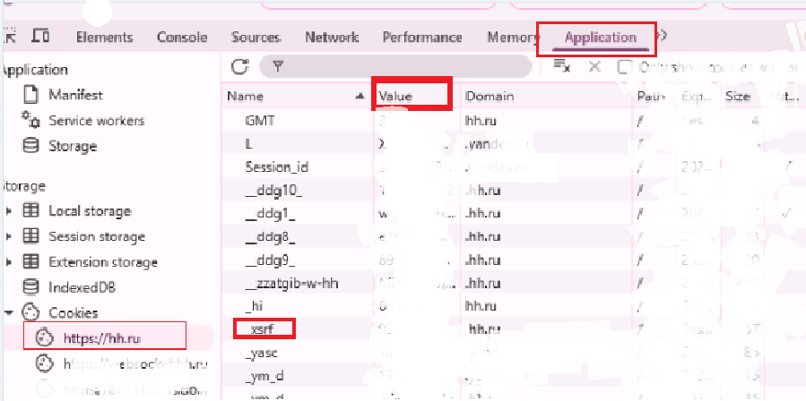
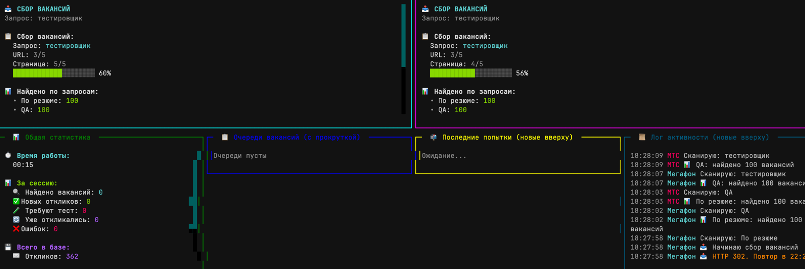

## 🇬🇧 Automating hh.ru job responses — *resume-pusher-hh*
Three Python scripts for automatically applying to jobs and lifting your resume on [hh.ru](https://hh.ru):
📤 bulk apply to jobs via search URL
📈 regularly lifts your resume to keep it visible
🛠 advanced mode with filtering and structured vacancy output
🔥 **multi-account TUI version** with real-time statistics and parallel processing

---

## 🇷🇺 Скрипт для автоматического отклика на hh.ru — *resume-pusher-hh*
**Три Python-скрипта**, которые автоматизируют отклики на вакансии на [hh.ru](https://hh.ru):
📤 отправка откликов по ссылке на поиск
📈 автоматическое поднятие резюме
🛠 поддержка расширенного режима с красивым выводом вакансий
🔥 **мультиаккаунт версия с TUI** — работа с несколькими аккаунтами одновременно и детальной статистикой  


---


## 📁 Скрипты

| Скрипт           | Назначение                                                                 |
|------------------|----------------------------------------------------------------------------|
| `clicker-base.py` | Базовый откликатель — простой, минимальный, подходит для тестов           |
| `clicker.py`      | Расширенный бот: логика с интервалами, вывод табличек, фильтрация ошибок  |
| `multi-v2.py`     | 🔥 **Мультиаккаунт TUI** — продвинутый интерфейс с несколькими аккаунтами, автоподнятием резюме, детальной статистикой |
| `telegram_bot.py` | 🤖 **Telegram бот** — браузерная автоматизация через Playwright, управление через Telegram |

## 🤖 Telegram бот (новое!)

**Telegram бот** использует браузерную автоматизацию для реального взаимодействия с сайтом hh.ru.

### Быстрый старт:

```bash
# Автоматическая установка
./setup.sh        # Linux/Mac
setup.bat         # Windows

# Запуск
./run.sh          # Linux/Mac
run.bat           # Windows
```

📚 Подробная документация: [BOT_README.md](BOT_README.md) | [QUICKSTART.md](QUICKSTART.md)

---

## ⚙️ Что нужно настроить

### 🗝 1. Получите ключи из браузера
1. Зайдите на [hh.ru](https://hh.ru) под своим аккаунтом.
2. Нажмите `F12`, откройте вкладку **Application**.
3. В левой панели выберите `Cookies → https://hh.ru`
4. Найдите и скопируйте значения:

```text
hhtoken
hhul
crypted_id
_xsrf
```


### 📄 2. Resume hash
Перейдите на страницу вашего резюме и скопируйте hash из URL:

```
https://hh.ru/resume/<ваш_hash>
```

Сохраняйте только часть после `/resume/`, например:
```python
resume_hash = "d4d77659ff04cef5520039ed1f6d6c73563035"
```

### 🔗 3. Ссылка на вакансии
Скопируйте ссылку из hh.ru после настройки фильтров поиска, например:
```python
url = "https://hh.ru/search/vacancy?area=1&experience=doesNotMatter"
```

---

## 📬 Пример сопроводительного письма
```python
my_letter = (
    "Здравствуйте!\n\n"
    "Я выражаю искренний интерес к возможности присоединиться к вашей компании. "
    "Ознакомившись с деятельностью вашей организации, уверен(а), что мой опыт и навыки могут быть полезны вашей команде.\n\n"
    "С уважением,\n"
    "Имя Отчество\n"
    "📞 +6 (111) 123-45-37\n"
    "📧 example@mail.ru"
)
```


## 📦 4. Установка зависимостей

### Рекомендуется использовать виртуальное окружение:

**Автоматическая установка:**
```bash
./setup.sh        # Linux/Mac
setup.bat         # Windows
```

**Ручная установка:**
```bash
# Создать виртуальное окружение
python3 -m venv venv
source venv/bin/activate  # Linux/Mac
# или
venv\Scripts\activate    # Windows

# Установить зависимости
pip install -r requirements.txt
```

Все зависимости включены в файл `requirements.txt`:
- `requests`, `aiohttp` — для HTTP-запросов
- `beautifulsoup4` — для парсинга HTML
- `glom` — для извлечения данных из JSON
- `tabulate` — для красивых таблиц (clicker.py)
- `rich` — для форматированного вывода
- `textual` — для TUI-интерфейса (multi-v2.py)
- `python-telegram-bot` — для Telegram API (telegram_bot.py)
- `playwright` — для браузерной автоматизации (telegram_bot.py)


## ⏱ Особенности `clicker.py`
- Поднимает резюме каждые `4 часа 10 минут`
- Откликается раз в `2 часа`
- Выводит табличку с информацией о каждой вакансии (через `glom` и `tabulate`)
- Пропускает вакансии, где требуется тест

---

## 🚀 Запуск

### 🤖 Telegram бот (рекомендуется для браузерной автоматизации)
```bash
# Активируйте виртуальное окружение
source venv/bin/activate  # Linux/Mac
# или
venv\Scripts\activate      # Windows

# Установите токен и запустите
export TELEGRAM_BOT_TOKEN='ваш_токен'  # Linux/Mac
set TELEGRAM_BOT_TOKEN=ваш_токен        # Windows
python telegram_bot.py

# Или используйте скрипты запуска
./run.sh    # Linux/Mac
run.bat     # Windows
```

### Базовые версии
```bash
python clicker.py
# или
python clicker-base.py
```

### 🔥 Multi-аккаунт версия с TUI
```bash
python multi-v2.py
```

---

## 🎯 Multi-v2 — Продвинутый мультиаккаунт бот

**multi-v2.py** — это самая мощная версия с красивым TUI-интерфейсом на базе [Textual](https://textual.textualize.io/).

### ✨ Возможности:
- 🔄 **Несколько аккаунтов одновременно** — работайте с 2+ аккаунтами параллельно
- 🎨 **Интерактивный TUI-интерфейс** — панели с детальной статистикой в реальном времени
- 📤 **Автоподнятие резюме** — каждые 4 часа автоматически поднимает резюме
- 💾 **Сохранение данных** — все отклики и вакансии с тестами сохраняются в `data/`
- 📊 **Детальная статистика** — по каждому аккаунту и общая
- 🎯 **Умная фильтрация** — пропускает вакансии с тестами и повторные отклики
- ⚙️ **Настройки на лету** — меняйте параметры прямо во время работы (клавиши 1-4)
- 📝 **Логи активности** — полная история действий с отладочной информацией

### 🎮 Управление:
- **Q** — Выход
- **P** — Пауза/Продолжить
- **1** — Изменить количество страниц на запрос
- **2** — Изменить задержку между откликами
- **3** — Изменить паузу между циклами
- **4** — Изменить интервал проверки лимита
- **A** — Показать список всех откликов
- **T** — Показать список вакансий с тестами
- **M** — Вернуться к главному экрану

### 📸 Интерфейс:


### ⚙️ Настройка multi-v2:
Откройте `multi-v2.py` и отредактируйте раздел `accounts_data` (строки 167-216):

```python
accounts_data = [
    {
        "name": "Основной аккаунт",
        "short": "MAIN",
        "color": "cyan",
        "resume_hash": "<ВАШ_RESUME_HASH>",
        "letter": (
            "Здравствуйте!\n\n"
            "Ваше сопроводительное письмо...\n\n"
            "С уважением,\n"
            "Имя Фамилия"
        ),
        "urls": [
            "https://hh.ru/search/vacancy?text=Python&area=1&items_on_page=20",
            "https://hh.ru/search/vacancy?text=Backend&area=1&items_on_page=20",
        ],
        "cookies": {
            "hhtoken": "<HHTOKEN>",
            "hhul": "<HHUL>",
            "crypted_id": "<CRYPTED_ID>",
            "_xsrf": "<XSRF>",
        },
    },
    # Добавьте второй аккаунт по той же схеме...
]
```

### 📁 Структура данных multi-v2:
Скрипт автоматически создаст папку `data/` со следующими файлами:
- `applied_vacancies.json` — все отклики по аккаунтам
- `test_required_vacancies.json` — вакансии, требующие тестов
- `debug.log` — детальный лог для отладки

---


